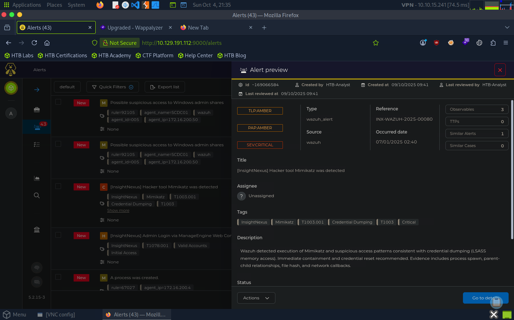

# Incident Handling Process

> HTB Academy — SOC Analyst Job Role Path (CDSA)

## Overview

This module covers the incident handling lifecycle, detection and analysis, investigation, containment, eradication, recovery, and post-incident activities.

The goal is to understand how security incidents are prepared for, detected, investigated, contained, and resolved.

---

## Core Concepts

### Incident Handling Lifecycle

```text
Preparation
     ↓
Detection & Analysis
     ↓
Containment, Eradication & Recovery
     ↓
Post-Incident Activity
     ↺
```

Incident handling is a continuous process rather than a strictly linear workflow.

### Cyber Kill Chain

The Cyber Kill Chain provides a high-level view of how an attack progresses.

```text
Reconnaissance
     ↓
Weaponization
     ↓
Delivery
     ↓
Exploitation
     ↓
Installation
     ↓
Command & Control
     ↓
Actions on Objectives
```

The defensive objective is to detect and disrupt adversary activity as early as possible.

### MITRE ATT&CK

MITRE ATT&CK provides a granular representation of adversary behavior through tactics, techniques, and sub-techniques.

| Technique | Description                         |
| --------- | ----------------------------------- |
| T1059.001 | PowerShell                          |
| T1021.001 | Remote Services: RDP                |
| T1003.001 | OS Credential Dumping: LSASS Memory |
| T1105     | Ingress Tool Transfer               |
| T1486     | Data Encrypted for Impact           |

### Pyramid of Pain

The Pyramid of Pain illustrates how difficult different types of indicators are for an adversary to change.

```text
             TTPs
           Tools
      Network/Host Artifacts
          Domains
            IPs
           Hashes
```

Hashes and IP addresses are generally easier to change, while tools and TTPs are more difficult to modify.

---

## Incident Response Process

### Preparation

Incident response capability must exist before an incident occurs.

Key preparation areas:

* Incident response policies, procedures, roles, and escalation paths
* Asset inventory, network diagrams, and known-clean baselines
* Evidence preservation and chain of custody
* Secure incident documentation and communication
* Emergency privileged access
* Forensic and investigation resources

### Protective Controls

Preventive and defensive controls can reduce attack surface and improve detection capabilities.

* DMARC / SPF / DKIM
* Endpoint hardening, EDR, AMSI, and Attack Surface Reduction
* MFA, PIM, LAPS, and privileged access controls
* Network segmentation, firewalls, IDS / IPS
* Vulnerability management
* Security awareness and phishing testing
* Active Directory security assessments
* Purple Team exercises

### Detection & Analysis

Detection can originate from:

* User reports
* EDR / antivirus
* SIEM
* IDS / IPS
* Firewalls
* Threat hunting
* Third-party notifications

Detection should provide visibility across multiple layers:

```text
Network Perimeter
       ↓
Internal Network
       ↓
Endpoint
       ↓
Application
```

### Investigation & Triage

Initial investigation should establish enough context to understand the incident before major response actions are taken.

Important information includes:

* Date and time
* Detection source and reporter
* Incident type
* Affected systems
* Hostnames, IP addresses, and operating systems
* System owners and purpose
* Current system state
* User activity
* Ongoing suspicious activity
* Malware, artifacts, hashes, and forensic evidence

### Incident Timeline

A timeline helps correlate evidence and reconstruct attacker activity.

| Date | Time | Hostname | Event Description | Data Source |
| ---- | ---- | -------- | ----------------- | ----------- |

Focus on events that are relevant to the investigation and preserve the original context of the evidence.

### Severity, Scope & Communication

Incident severity should consider:

* Potential impact
* Exploitation requirements
* Business-critical systems
* Number of affected systems
* Threat propagation capabilities
* Available remediation options

Incident information should follow a **need-to-know** principle and be communicated through controlled channels with the appropriate stakeholders.

### Containment, Eradication & Recovery

After understanding the scope of an incident:

```text
Containment
     ↓
Eradication
     ↓
Recovery
     ↓
Validation
```

* Contain affected systems and prevent further spread
* Remove malware, persistence, and attacker access
* Restore systems and business operations
* Validate that the environment is secure

---

## Tools & Technologies

| Tool / Technology | Purpose                                    |
| ----------------- | ------------------------------------------ |
| TheHive           | Incident and case management               |
| SIEM              | Log collection, correlation, and detection |
| EDR               | Endpoint visibility and detection          |
| IDS / IPS         | Network threat detection and prevention    |
| Firewall          | Network traffic control                    |
| Sysmon            | Windows telemetry                          |
| MITRE ATT&CK      | Adversary behavior mapping                 |

---

## Hands-on Lab

### Lab 01 — TheHive Incident Investigation

TheHive was used to investigate a security alert related to **Mimikatz and credential dumping**.

Key activities:

* Alert triage
* Incident investigation
* MITRE ATT&CK mapping
* Evidence documentation



---

## Investigation Workflow

```text
Detection
   ↓
Initial Triage
   ↓
Establish Context
   ↓
Determine Scope
   ↓
Build Timeline
   ↓
Collect Evidence
   ↓
Identify IoCs / TTPs
   ↓
Containment
   ↓
Eradication
   ↓
Recovery
   ↓
Lessons Learned
```

---

## Key Takeaways

* Incident response starts before an incident occurs.
* Effective detection requires visibility across multiple layers.
* Initial triage should establish context before major response actions.
* Timelines help correlate evidence and reconstruct attacker activity.
* Severity depends on impact, scope, and threat characteristics.
* MITRE ATT&CK provides a structured way to describe adversary behavior.
* TheHive can centralize alerts, evidence, investigation findings, and response activities.
* Preventive controls and detection capabilities directly influence incident response effectiveness.

---

## References

* Hack The Box Academy — Incident Handling Process
* MITRE ATT&CK
* NIST SP 800-61
