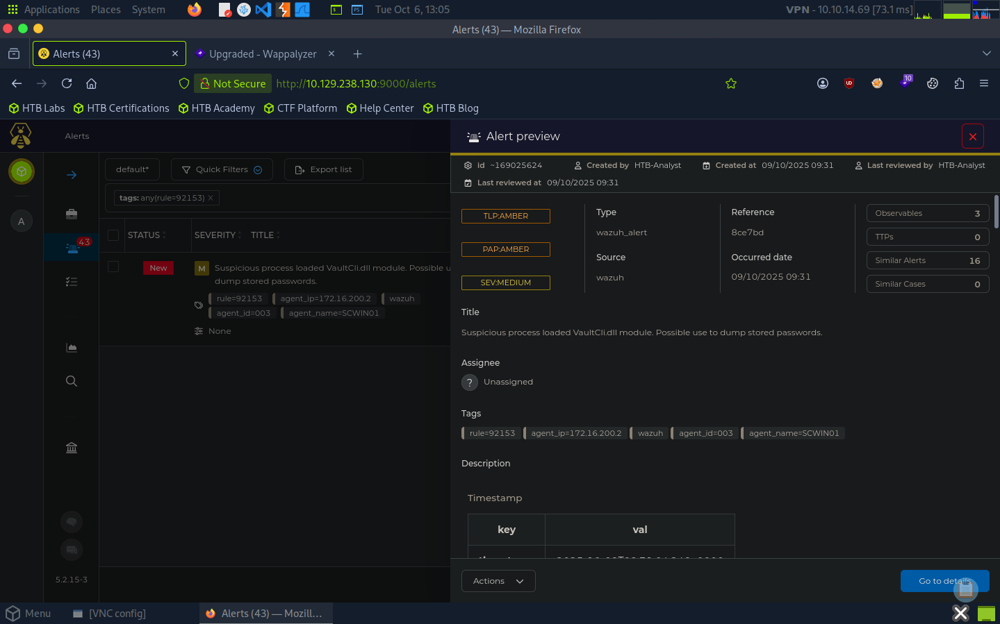

Lab 02 — TheHive VaultCli.dll Investigation
Objective

Investigate a Wazuh alert in TheHive involving the loading of VaultCli.dll and assess the associated credential access activity.

Investigation

The alert was generated by rule=92153 after Sysmon detected the loading of VaultCli.dll on the Windows endpoint SCWIN01.

The telemetry showed:

Process: mimikatz.exe
Loaded Module: C:\Windows\System32\vaultcli.dll
Sysmon Event ID: 7 — Image Loaded
MITRE ATT&CK: T1555 — Credentials from Password Stores
Host: SCWIN01
Source: Wazuh

The alert also contained multiple file hashes for the observed module, which can be used as IOCs during further investigation.

Findings

The combination of mimikatz.exe and VaultCli.dll loading is suspicious because Mimikatz can be used to access credential material stored by Windows.

The investigation demonstrates how endpoint telemetry can provide useful context for validating a security alert and identifying relevant IOCs and attacker behavior.

Evidence

Key Takeaways
Investigated a Wazuh alert through TheHive.
Correlated Sysmon telemetry with the security alert.
Identified suspicious mimikatz.exe activity.
Identified VaultCli.dll as a relevant artifact.
Mapped the activity to MITRE ATT&CK T1555.
Identified file hashes as potential IOCs for further investigation.