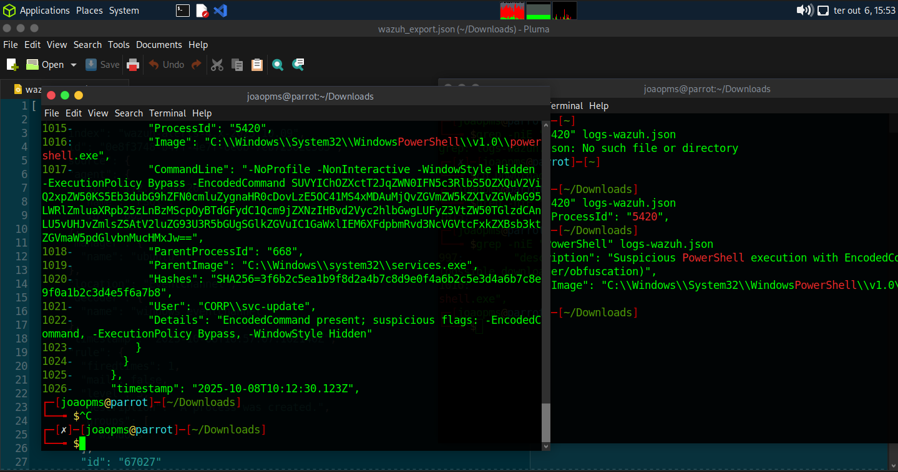

# Lab 04 — Skills Assessment

## Objective

Apply the incident handling process in a practical assessment involving alert triage, threat intelligence, log analysis, IOC identification, and MITRE ATT&CK mapping.

## Investigation

The assessment involved investigating the Insight Nexus environment and correlating security telemetry from multiple sources.

Key activities included:

* TheHive alert triage
* Wazuh log analysis
* Sysmon event investigation
* Threat intelligence enrichment
* PowerShell analysis
* IOC identification
* MITRE ATT&CK mapping
* Incident correlation and scope assessment

## Threat Intelligence

An external IP indicator identified during the assessment was investigated using **VirusTotal**.

The investigation included reviewing the IP's reputation and available network intelligence, including **WHOIS information** and related infrastructure details.

This enrichment helped provide additional context for assessing the indicator and determining whether the observed network activity was suspicious.

## TheHive Analysis

TheHive was used to review alerts and correlate incident-related activity.

The assessment included investigation of an alert associated with `rule=92153` and the `VaultCli.dll` module, providing additional context for the credential access activity observed in the environment.

## Commands Used

Search the Wazuh logs for PowerShell-related alerts:

```bash
grep -niE "PowerShell" logs-wazuh.json
```

Display the surrounding context of the identified PowerShell event:

```bash
grep -ni -B 50 -A 50 "PowerShell" logs-wazuh.json
```

These commands were used to locate the suspicious PowerShell execution and inspect the surrounding event data.

## PowerShell Analysis

A suspicious PowerShell execution was identified in the collected Wazuh logs.

The command used:

* `-EncodedCommand`
* `-ExecutionPolicy Bypass`
* `-WindowStyle Hidden`

The encoded command was analyzed to reveal the underlying activity and identify an associated external network indicator.

The event also provided the account associated with the suspicious PowerShell execution.

## MITRE ATT&CK

MITRE ATT&CK was used to map observed attacker behaviors to relevant techniques during the assessment.

The investigation included identifying techniques associated with activities such as tool transfer, credential access, and command execution.

## Evidence



## Key Findings

The assessment demonstrated how multiple sources of security telemetry and threat intelligence can be correlated to reconstruct attacker activity and enrich an incident investigation.

## Key Takeaways

* Correlated TheHive, Wazuh, and Sysmon data.
* Used VirusTotal and WHOIS information to enrich an external IP indicator.
* Investigated a TheHive alert associated with `VaultCli.dll`.
* Analyzed encoded PowerShell activity.
* Used command-line analysis to locate relevant security events.
* Identified relevant IOCs and attacker infrastructure.
* Applied MITRE ATT&CK to characterize adversary behavior.
